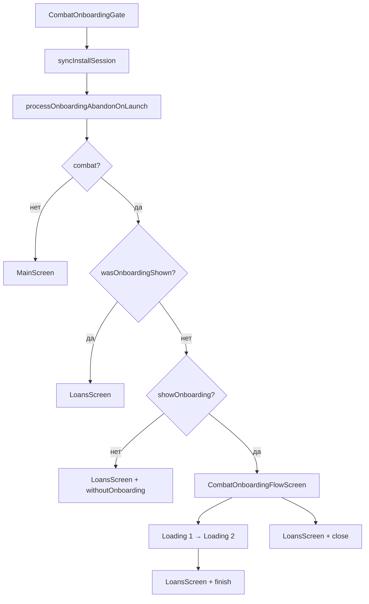

# Боевой онбординг: навигация, локальное состояние и аналитика

Документ описывает **текущую** реализацию боевого онбординга (`AppMode.combat`): когда он показывается, какие флаги хранятся на устройстве, куда уходят события в **Firebase Analytics (GA4)** и **AppMetrica**, и как формируется **`aff_sub10`** в ссылках офферов.

Связанные документы: [COMBAT_ONBOARDING_FIRESTORE.md](./COMBAT_ONBOARDING_FIRESTORE.md), [APP_MODE_SYSTEM.md](./APP_MODE_SYSTEM.md).

---

## 1. Точка входа и общая схема

```text
main.dart → AppModeWrapper
  ├─ AppMode.combat    → CombatOnboardingGate(appMode: combat)
  └─ AppMode.nonCombat → CombatOnboardingGate(appMode: nonCombat) → MainScreen
```

В боевом режиме гейт решает: **онбординг** (`CombatOnboardingFlowScreen`) или сразу **витрина займов** (`LoansScreen`).



**Файлы:**

| Компонент | Путь |
|-----------|------|
| Гейт | `lib/features/combat_onboarding/ui/combat_onboarding_gate.dart` |
| Поток онбординга | `lib/features/combat_onboarding/ui/combat_onboarding_flow_screen.dart` |
| Экраны загрузки | `lib/features/combat_onboarding/ui/combat_onboarding_loading_screen.dart` |
| Локальное состояние | `lib/features/combat_onboarding/services/combat_onboarding_local_state.dart` |
| Настройки `showOnboarding` | `lib/features/combat_onboarding/services/combat_settings_resolver.dart` |
| Firebase Analytics | `lib/services/firebase_analytics_service.dart` |
| AppMetrica | `lib/services/appmetrica_service.dart` |
| Витрина + showcase | `lib/views/loans/loans_screen.dart`, `lib/services/combat_showcase_analytics.dart` |
| aff_sub10 в ссылках | `lib/services/web_link_service.dart` |

---

## 2. Когда показывается онбординг

Онбординг в бою **не привязан к «первому запуску приложения»**. Решение принимается по флагу **`combat_onboarding_was_shown`** в SharedPreferences.

| Условие | Результат |
|---------|-----------|
| Режим не `combat` | `MainScreen`, онбординг не показывается |
| `wasOnboardingShown == true` | Сразу `LoansScreen` |
| `settings.showOnboarding == false` | `LoansScreen` с причиной `withoutOnboarding` |
| Иначе | `CombatOnboardingFlowScreen` |

`showOnboarding` берётся с **сервера** (приоритет), fallback — Firestore `settings/general` (`CombatSettingsResolver`).

### 2.1. Переустановка и iOS

При старте вызывается `CombatOnboardingLocalState.syncInstallSession()`:

- сравнение отпечатка установки (на iOS — `PackageInfo.updateTime`, на Android — `installTime`);
- сверка session id в Keychain (`flutter_secure_storage`) и SharedPreferences.

При новой установке сбрасываются флаги онбординга, чтобы онбординг снова мог показаться.

### 2.2. Первый запуск приложения vs показ онбординга

| Понятие | Ключ / логика | Назначение |
|---------|---------------|------------|
| Первый запуск приложения | `combat_onboarding_first_open_at_iso` + `isFirstOpen()` | Запись в Firestore `users/{id}` (`writeNotShownIfFirstOpen`) |
| Онбординг уже показывали | `combat_onboarding_was_shown` | Не показывать поток повторно |

Сценарий: пользователь первый раз открыл приложение в **небоевом** режиме, затем в **боевом** — онбординг **покажется**, если `was_shown` ещё `false`.

---

## 3. Локальное состояние (SharedPreferences / Keychain)

| Ключ | Тип | Смысл |
|------|-----|--------|
| `combat_onboarding_was_shown` | bool | Пользователь видел экран онбординга (контент загружен) |
| `combat_onboarding_fully_completed` | bool | Онбординг доведён до конца (после animation2 + запись) |
| `combat_onboarding_flow_active` | bool | Сейчас в потоке онбординга / loading (не на займах) |
| `combat_onboarding_abandoned` | bool | Уход в фон без `resumed` (кандидат на kill) |
| `combat_onboarding_first_open_at_iso` | string | Дата первого открытия приложения |
| `combat_onboarding_last_known_install_time_ms` | int | Отпечаток установки для детекта переустановки |
| `sub10` (`WebLinkService.prefSub10Key`) | string | Значение для **aff_sub10** |
| `aff_sub10_applied` | bool | sub10 уже подставлен в **любую** ссылку (оффер или main) |
| Keychain: `combat_onboarding_install_session_id` | string | ID сессии установки (iOS) |

Значения **`aff_sub10`** (`sub10`):

| Значение | Когда записывается |
|----------|-------------------|
| `onboarding_finish` | Переход на займы после успешного финала онбординга |
| `onboarding_close` | Закрытие онбординга крестиком → займы |
| `onboarding_none` | Бой без показа онбординга (`showOnboarding == false`) |
| `onboarding_kill` | Kill / обрыв во время незавершённого онбординга (см. §5) |

---

## 4. Поток онбординга и побочные действия

### 4.1. Загрузка конфигурации

`CombatOnboardingFlowScreen._load()` → Firestore `onboarding` (1 ретрай).

- Успех → `_logOnboardingShowOnce()` → `was_shown = true`, `flow_active = true`.
- Ошибка → `LoansScreen` с `afterOnboardingClose` (без показа контента).

### 4.2. Действия пользователя

| Действие | Навигация | Firestore `users` | aff_sub10 (в prefs) |
|----------|-----------|-------------------|---------------------|
| «Продолжить» на старте | Следующая страница | — | — |
| Ответ на вопрос | Следующая страница | — | — |
| Крестик | `LoansScreen` + `close` | `writeResult(endOnbord: false)` | `onboarding_close` |
| Финал + телефон + согласие | Loading1 → Loading2 → `LoansScreen` + `finish` | `writeResult(endOnbord: true)` + `fully_completed` | `onboarding_finish` |

При любом штатном переходе на займы вызывается `endOnboardingFlow()` (сброс `abandoned` и `flow_active`).

### 4.3. Запись в Firestore

`CombatOnboardingUserWriter`:

- **`writeNotShownIfFirstOpen`** — только при **первом запуске приложения** в небоевом режиме или при `withoutOnboarding` на первом открытии; `lastOnbordpage: "Not shown"`.
- **`writeResult`** — при закрытии / завершении онбординга; поля `endOnbord`, `lastOnbordpage`, `answersOnbord`, `phone`.

---

## 5. Kill приложения и `onboarding_kill`

Kill **нельзя** поймать в момент завершения процесса. Фиксация — через prefs + обработка на **следующем cold start**.

### 5.1. Во время сессии (`CombatShowcaseLifecycleObserver`)

При `inactive` / `paused` / `detached` (iOS: в т.ч. открытие карусели приложений):

- если `combat`, `flow_active`, не `fully_completed`, займы ещё не открыты → `onboarding_abandoned = true`.

При **`resumed`** → `onboarding_abandoned = false` (пользователь вернулся — это не kill).

### 5.2. На следующем запуске (`processOnboardingAbandonOnLaunch`)

Если **`abandoned || flow_active`** (подстраховка, если lifecycle не успел), и:

- `was_shown == true`
- `fully_completed == false`
- `aff_sub10_applied == false`
- `sub10` пустой

→ в prefs пишется **`sub10 = onboarding_kill`**.

Затем флаги `abandoned` и `flow_active` сбрасываются.

---

## 6. Витрина займов (`LoansScreen`) — только боевой режим

### 6.1. События showcase (Firebase + AppMetrica)

Отправляются **параллельно** через `CombatShowcaseAnalytics` / `FirebaseAnalyticsService` + `AppMetricaService.reportEvent`.

| Событие | Когда | Firebase | AppMetrica |
|---------|-------|----------|------------|
| `showcase_shown` | Каждое создание `LoansScreen` в бою (`initState`, post-frame) | ✓ | ✓ |
| `showcase_not_shown` | Через **2 с** после `paused`/`detached`, если был онбординг, займы не открывали, один раз за сессию | ✓ | ✓ |
| `showcase_error` | Ошибка загрузки офферов в `_loadOffers` (внешний `catch`, combat) | ✓ + `message` | ✓ + `message` |

Дополнительно в AppMetrica при открытии займов:

- `reportScreen('loans_combat_mode')` или `loans_non_combat_mode` — в `LoansScreen.initState`.

### 6.2. События `show_case_onboarding_*`

Один раз при первом показе `LoansScreen` **с параметром** `showCaseOnboardingReason` (post-frame):

| Reason | Firebase | AppMetrica | aff_sub10 в prefs |
|--------|----------|------------|-------------------|
| `afterOnboardingFinish` | `show_case_onboarding_finish` | то же | `onboarding_finish` |
| `afterOnboardingClose` | `show_case_onboarding_close` | то же | `onboarding_close` |
| `withoutOnboarding` | `show_case_onboarding_none` | то же | `onboarding_none` |

Если пользователь вернулся на займы **без** reason (например, после kill) — эти события **не** шлются повторно; `sub10` может быть уже `onboarding_kill` из §5.

---

## 7. События онбординга (Firebase + AppMetrica)

Все события дублируются в **оба** сервиса из `CombatOnboardingFlowScreen` (кроме случаев, указанных отдельно).

| Событие | Когда | Параметры |
|---------|-------|-----------|
| `onboarding_show` | Конфиг онбординга загружен, контент показан | — |
| `onboarding_start` | Нажатие «Продолжить» на стартовом экране | — |
| `onboarding_page_{N}` | Выбор ответа на вопросе страницы `pageN` | `question_answer` (строка) |
| `onboarding_close` | Закрытие крестиком | `page_number` (1…N) |
| `onboarding_finish` | Успешное нажатие на финальном экране (до loading) | — |

**GA4:** длинные строки параметров обрезаются до 100 символов (`FirebaseAnalyticsService.trimForGa`).

---

## 8. aff_sub10 в ссылках офферов

Логика: `WebLinkService.generateModifiedOfferLink()` (только **`AppMode.combat`** / `isBoyMode`).

### 8.1. Условие подстановки

**Не** «первая сессия приложения», а:

```text
sub10 в prefs не пустой
И aff_sub10_applied != true
```

После первой подстановки в ссылку (оффер или `buildMainLink`):

- `aff_sub10_applied = true`
- **второй и последующие** офферы — **без** `aff_sub10`.

### 8.2. Формат в URL

```text
{offer_link}&aff_sub6={appmetrica_device_id}&aff_sub10={sub10}
```

`aff_sub6` — device id AppMetrica (как и раньше).

### 8.3. Когда записывается `sub10` в prefs

| Источник | Значение |
|----------|----------|
| `LoansScreen._saveOnboardingReason` | `finish` / `close` / `none` |
| `processOnboardingAbandonOnLaunch` | `onboarding_kill` |

### 8.4. Событие `offer_open`

При тапе на оффер (после успешной модификации ссылки, перед WebView):

- Firebase: `offer_open` (`link`, `name`)
- AppMetrica: `offer_open` с теми же параметрами

---

## 9. Сводная таблица: куда уходит аналитика

| Категория | Firebase Analytics | AppMetrica | aff_sub10 | Firestore users |
|-----------|-------------------|------------|-----------|-----------------|
| Показ онбординга | `onboarding_show` | ✓ | — | — |
| Шаги онбординга | `onboarding_*` | ✓ | — | `writeResult` при close/finish |
| Показ витрины | `showcase_shown` | ✓ | — | — |
| Витрина без показа после онбординга | `showcase_not_shown` | ✓ | — | — |
| Ошибка витрины | `showcase_error` | ✓ | — | — |
| Путь на витрину | `show_case_onboarding_*` | ✓ | пишется в prefs | — |
| Kill онбординга | — | — | `onboarding_kill` → 1-й оффер | — |
| Открытие оффера | `offer_open` | ✓ | в URL если не applied | — |
| Экран займов | — | `screen_view` / `loans_combat_mode` | — | — |

---

## 10. Инициализация SDK

| Сервис | Где инициализируется |
|--------|----------------------|
| AppMetrica | `main.dart` → `AppMetricaService().initialize()` |
| Firebase (Analytics в составе) | `main.dart` → `FirebaseService().initialize()` |

События отправляются **по мере действий пользователя**; отдельной очереди в приложении нет. Ошибки отправки в AppMetrica логируются в debug, не пробрасываются на UI.

---

## 11. Отладка

Полезные префиксы в консоли:

- `CombatOnboardingLocalState:` — kill, reset, aff_sub10
- `WebLinkService:` — sub6/sub10 в ссылке, `aff_sub10_applied`
- `CombatOnboarding:` / `CombatOnboardingFlowScreen` — навигация потока
- `AppMetrica event sent:` — события AppMetrica (debug)

**Проверка kill на iOS:** онбординг → карусель приложений → смахнуть приложение → перезапуск → первый оффер должен содержать `aff_sub10=onboarding_kill`; второй оффер — без sub10.

---

## 12. Ограничения (важно для продукта)

1. **Kill** определяется эвристически (abandon без `resumed` + cold start), не на 100% как «системный kill».
2. **`showcase_not_shown`** и **kill** — разные механизмы: первое — аналитика через 2 с в фоне; второе — трекинг в ссылке оффера.
3. **`showcase_shown`** уходит при каждом **новом** `State` у `LoansScreen` (не при возврате из WebView тем же экраном).
4. Документ [COMBAT_ONBOARDING_FIRESTORE.md](./COMBAT_ONBOARDING_FIRESTORE.md) в части «только первое открытие» для показа онбординга **устарел** — актуально правило **`wasOnboardingShown`** (§2).

---

*Последнее обновление: соответствует коду с `onboarding_kill`, `inactive` lifecycle и `aff_sub10_applied`.*
